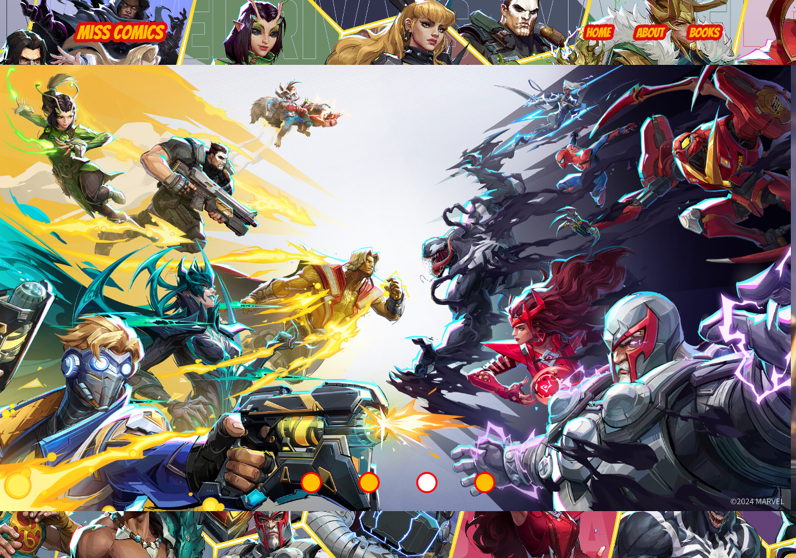

# Miss Comics
#### Where Marvel Fans Assemble!

##  Table of Contents
- [Description](#description)
- [pages](#pages)
- [Main Features](#main-features)
- [Comics CRUDL](#comics-crudl)
- [Technologies Used](#technologies-used)

## Description
Miss Comicsis your go-to platform for managing and exploring Marvel comic books. Our site allows you to search for Marvel comics, access detailed information about them, update their details, and even remove outdated entries. Whether you're a dedicated collector or a casual fan, Miss Comics provides the tools you need to organize and expand your Marvel knowledge with ease.

## pages
- **Home:** A simple page featuring a high-quality image slider.
- **About:** A page providing an overview of the site and its features.
- **Books:** A page displaying a list of comics, with options to search, filter, update, and delete entries.

## Main Features
- **Comics Management:** Users can update and delete comic book entries, ensuring the database remains accurate and up to date.
- **Advanced Search & Filtering:** Users can efficiently search for comics within the site’s database using a powerful filter system. Comics can be found based on various criteria, including title, price, page count, publication date, author, and sale status.
- **Detailed Comic Information:** By clicking the “Book Details” button or the comics thumbnail, users are redirected to a dedicated information page. This page provides comprehensive details about the selected comic.
- **Image Slider:** The homepage features a high-quality image slider, designed to showcase promotions and featured Marvel comics, enhancing user engagement.

## Comics CRUDL 
- Read – View the detailed information of a selected comic.
- Update – Modify the details of an existing comic, ensuring the information is accurate and current.
- Delete – Remove a comic from the list when it is no longer needed or relevant.
- List – Comics are displayed in a list, with search and filtering options to help users easily find what you're looking for.

## Technologies Used
This project uses the following technologies:

- **HTML** 
- **JavaScript** 
- **CSS** 
- **React** 
- **Babel** 

These technologies work together to create a seamless and interactive user experience.

## Site Preview

